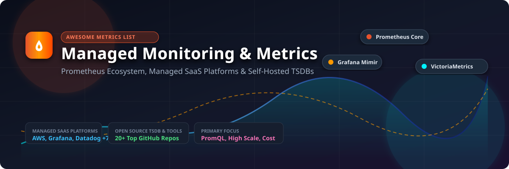

# 🚀 Awesome Managed Monitoring & Metrics (Prometheus)

<div align="center">

<a href="https://github.com/ishandutta2007/Awesome-Awesome-Awesome"></a><a href="https://discord.gg/jc4xtF58Ve"></a>


<a href="https://github.com/ishandutta2007"></a>

<br/><br/>



</div>

---

## 📌 Overview & SEO Summary

Welcome to the ultimate curated directory of **Managed Prometheus SaaS platforms**, **Time-Series Databases (TSDB)**, and **Open-Source Infrastructure Monitoring Solutions**. 

Whether you are looking for enterprise-grade **managed Prometheus**, high-cardinality **metrics aggregation**, long-term metrics retention with **Thanos**, **Mimir**, or **VictoriaMetrics**, or cloud-native observability stacks for **Kubernetes**, this guide covers the complete telemetry landscape updated for **October 2026**.

---

## 📑 Table of Contents

- [📊 Market Overview & Industry Structure](#-market-overview--industry-structure)
- [☁️ SaaS & Hosted Managed Metrics Platforms](#️-saas--hosted-managed-metrics-platforms)
- [🔓 Open-Source GitHub Projects (Sorted by Stars)](#-open-source-github-projects-sorted-by-stars)
  - [🔥 Top Open-Source Observability & Metrics Repositories](#-top-open-source-observability--metrics-repositories)
- [🤝 How to Contribute](#-how-to-contribute)
- [⚠️ Technical & Operational Disclaimers](#️-technical--operational-disclaimers)
- [📜 License](#-license)

---

## 📊 Market Overview & Industry Structure

> 💡 **Market Size & Structure Summary**: The global cloud observability and managed metrics market is valued at approximately **$5.2 Billion in 2026** and is projected to expand to **$10.5 Billion by 2030** (CAGR of ~15.2%). The sector is **moderately fragmented**: hyper-scaler cloud providers (AWS) and established observability giants (Datadog, Dynatrace, New Relic) co-exist alongside agile, high-performance specialized metric platform vendors (Grafana Labs, VictoriaMetrics, Chronosphere). High-cardinality metric management and cost optimization remain the primary competitive differentiators.

---

## ☁️ SaaS & Hosted Managed Metrics Platforms

Below is the comparative analysis of commercial managed Prometheus and cloud observability providers, **sorted by Company Scale & Valuation (Descending)**.

| 🏢 Platform / Provider | 💰 Company Scale / Valuation | 🏷️ Starting Pricing | 🎁 Free Tier / Trial Limits | ⚡ Key Strengths & Best Use Cases |
| :--- | :--- | :--- | :--- | :--- |
| **[Amazon Managed Service for Prometheus](https://aws.amazon.com/prometheus/)** ☁️ | **~$2.1 Trillion** *(AWS Market Cap)* | **$0.90** per 1M ingested metric samples; **$0.03** per GB-month storage | **40M metric samples/mo** ingested & **10 GB storage** for 90 days (AWS Free Tier) | Fully managed AWS Prometheus engine with PromQL, Alertmanager, and IAM auth. Best for AWS-native Kubernetes workloads. |
| **[Wavefront by VMware](https://www.wavefront.com/)** 🌊 | **~$300 Billion** *(Broadcom / Tanzu Unit)* | **$1.50** per 1pps (point per second) ingest rate (~$150/mo baseline) | **30-day free trial** with 10,000 pps ingestion rate limit | Real-time high-throughput metric analytics and streaming telemetry across multi-cloud environments. |
| **[Datadog](https://www.datadoghq.com/)** 🐶 | **~$38.0 Billion** *(NASDAQ: DDOG)* | **$15.00** /host/month (Pro Infra); **$0.10** per 100 custom metrics | **Free forever** up to 5 hosts (1-day retention) or **14-day unlimited trial** | Industry-leading unified SaaS observability across metrics, logs, traces, and DogStatsD. Best for enterprise full-stack monitoring. |
| **[New Relic](https://newrelic.com/)** 📊 | **~$6.5 Billion** *(Private / TPG)* | **$0.35** per GB ingested beyond free tier + **$49** /core user/month | **Free forever**: 100 GB/month data ingestion + 1 full platform user | All-in-one observability platform with native Prometheus remote-write ingestion. Best for application-centric metric views. |
| **[Grafana Cloud Prometheus](https://grafana.com/products/cloud/)** 🟧 | **~$6.0 Billion** *(Grafana Labs)* | **$29.00** /month (Pro base plan) or **$0.50** per 1,000 active series | **Free forever**: 10,000 active metric series, 50 GB logs, 50 GB traces (14-day retention) | Fully managed Grafana Mimir & Prometheus ecosystem with global endpoints. Best for Grafana ecosystem users. |
| **[Sysdig Monitor](https://sysdig.com/)** 🛡️ | **~$2.5 Billion** *(Private)* | **$15.00** /agent/host/month (**$0.003** /agent-hour) | **30-day free trial** with full enterprise feature access | Cloud-native monitoring combined with deep eBPF container security and runtime threat detection. Best for K8s security & metrics. |
| **[Sumo Logic](https://www.sumologic.com/)** 🔍 | **~$1.7 Billion** *(Private / Francisco)* | **$0.09** per GB metric data ingested (Essentials starting tier) | **Free plan**: 1 GB/day data ingestion (automatically converted after 30-day trial) | Unified SaaS analytics combining infrastructure metrics, log management, and security SIEM. |
| **[Chronosphere](https://chronosphere.io/)** ⚡ | **~$1.6 Billion** *(Private)* | **$0.05** per 1,000 datapoints ingested (~$1,000/mo minimum tier) | **30-day free trial** demo cluster sandbox upon enterprise request | High-scale cloud-native observability platform engineered with automated telemetry control to combat high cardinality. |
| **[Coralogix](https://coralogix.com/)** 🎯 | **~$1.0 Billion** *(Private)* | **$0.42** per GB data ingested (straight pay-as-you-go rate) | **14-day free trial** with 15 GB/day data ingestion allowance | In-memory streaming telemetry analytics engine providing real-time metric alerting without expensive storage. |
| **[VictoriaMetrics Cloud](https://victoriametrics.com/)** bc | **~$50 Million** *(Bootstrapped Growth)* | **$0.18** per GB-month storage / **$0.015** /hour node minimum (~$11/mo) | **$200 free credit** on a 14-day free trial | Managed VictoriaMetrics cluster delivering up to 10x resource efficiency over standard Prometheus. Best for cost optimization. |

---

## 🔓 Open-Source GitHub Projects (Sorted by Stars)

The following curated open-source projects form the backbone of self-hosted cloud monitoring, metric collection, TSDB storage, and alerting.

> 🌟 **Sorted by GitHub Star Count (Descending)**

### 🔥 Top Open-Source Observability & Metrics Repositories

1. **[Netdata](https://github.netdata.cloud/)** — [](https://github.com/netdata/netdata/stargazers) ⚡  
   *Real-time performance and health monitoring system with per-second granularity, auto-discovery, and zero-configuration dashboards. Best for real-time edge and server monitoring.*

2. **[Grafana](https://grafana.com)** — [](https://github.com/grafana/grafana/stargazers) 📊  
   *The standard open-source visualization and dashboard platform connecting 100+ telemetry data sources including Prometheus, Loki, and Tempo.*

3. **[Apache Superset](https://superset.apache.org)** — [](https://github.com/apache/superset/stargazers) 📈  
   *Enterprise-grade business intelligence and data visualization web application featuring SQL Lab, rich chart builders, and scalable security.*

4. **[Prometheus](https://prometheus.io)** — [](https://github.com/prometheus/prometheus/stargazers) 🔥  
   *The CNCF graduated de facto standard pull-based metric monitoring system featuring PromQL query language, dimensional data model, and Alertmanager integration.*

5. **[InfluxDB](https://www.influxdata.com)** — [](https://github.com/influxdata/influxdb/stargazers) ⏱️  
   *High-performance open-source time-series database designed for handling high-volume write and query workloads for metrics, IoT, and analytics.*

6. **[TimescaleDB](https://www.timescale.com)** — [](https://github.com/timescale/timescaledb/stargazers) 🐯  
   *An open-source time-series SQL database built as an extension on top of PostgreSQL, combining relational capabilities with automatic time-based partitioning.*

7. **[cAdvisor](https://github.com/google/cadvisor)** — [](https://github.com/google/cadvisor/stargazers) 🐳  
   *Container Resource Advisor by Google providing container users an understanding of the resource usage and performance characteristics of running containers.*

8. **[VictoriaMetrics](https://victoriametrics.com)** — [](https://github.com/VictoriaMetrics/VictoriaMetrics/stargazers) 🚀  
   *Fast, cost-effective, and scalable open-source time-series database and Prometheus monitoring solution featuring superior compression and MetricsQL support.*

9. **[Thanos](https://thanos.io)** — [](https://github.com/thanos-io/thanos/stargazers) 🌌  
   *CNCF graduated open-source project providing highly available Prometheus setups with unlimited metric retention over cloud object storage and unified global PromQL query view.*

10. **[node_exporter](https://prometheus.io)** — [](https://github.com/prometheus/node_exporter/stargazers) 💻  
    *Prometheus exporter for hardware and OS metrics exposed by UNIX/Linux kernels, providing foundational machine-level telemetry.*

11. **[Prometheus Operator](https://prometheus-operator.dev)** — [](https://github.com/prometheus-operator/prometheus-operator/stargazers) ⚙️  
    *Kubernetes Custom Resource Definitions (CRDs) simplifying the deployment, management, and configuration of Prometheus, Alertmanager, and Grafana instances on Kubernetes.*

12. **[Alertmanager](https://prometheus.io)** — [](https://github.com/prometheus/alertmanager/stargazers) 🔔  
    *Handles alerts sent by Prometheus server, providing deduplication, grouping, silence rules, and routing to Slack, PagerDuty, email, and webhooks.*

13. **[OpenTelemetry Collector](https://opentelemetry.io)** — [](https://github.com/open-telemetry/opentelemetry-collector/stargazers) 📡  
    *Vendor-agnostic proxy receiver, processor, and exporter for metrics, traces, and logs under the CNCF OpenTelemetry standard.*

14. **[Zabbix](https://www.zabbix.com)** — [](https://github.com/zabbix/zabbix/stargazers) 🛡️  
    *Enterprise-class open-source distributed monitoring platform for networks, servers, virtual machines, and cloud services.*

15. **[Blackbox Exporter](https://prometheus.io)** — [](https://github.com/prometheus/blackbox_exporter/stargazers) 🎯  
    *Allows blackbox probing of endpoints over HTTP, HTTPS, DNS, TCP, and ICMP, exporting synthetic uptime metrics to Prometheus.*

16. **[Cortex](https://cortexmetrics.io)** — [](https://github.com/cortexproject/cortex/stargazers) 🏛️  
    *CNCF incubator project offering horizontally scalable, multi-tenant, long-term storage for Prometheus.*

17. **[Grafana Mimir](https://grafana.com/oss/mimir/)** — [](https://github.com/grafana/mimir/stargazers) 🏛️  
    *The most scalable open-source long-term storage for Prometheus metrics, engineered for multi-tenancy, massive concurrency, and enterprise reliability.*

18. **[Grafana OnCall](https://grafana.com/oss/oncall/)** — [](https://github.com/grafana/oncall/stargazers) 📟  
    *Developer-friendly incident response and on-call schedule management platform with deep Slack, Telegram, and Grafana integration.*

19. **[Grafana Alloy](https://grafana.com/docs/alloy/latest/)** — [](https://github.com/grafana/alloy/stargazers) 🔌  
    *OpenTelemetry Collector distribution fully compatible with Prometheus, OpenTelemetry, and Grafana observability pipelines.*

20. **[Karma](https://github.com/prymitive/karma)** — [](https://github.com/prymitive/karma/stargazers) 🎛️  
    *Alert dashboard for Prometheus Alertmanager, aggregating alerts across multi-cluster environments with powerful filtering capabilities.*

21. **[Perses](https://perses.dev)** — [](https://github.com/perses/perses/stargazers) 🎨  
    *CNCF sandbox dashboard-as-code visualization platform engineered to provide a open standard alternative to proprietary dashboard definitions.*

22. **[Checkmk](https://checkmk.com)** — [](https://github.com/Checkmk/checkmk/stargazers) ⚙️  
    *Comprehensive IT monitoring platform offering automated service discovery and extensive infrastructure exporter plugins.*

---

## 🛠️ Recommended Architecture Blueprint

```
                     ┌────────────────────────┐
                     │  OpenTelemetry / Agent │
                     └───────────┬────────────┘
                                 │
                                 ▼
                     ┌────────────────────────┐
                     │   Prometheus Server    │
                     └───────────┬────────────┘
                                 │
       ┌─────────────────────────┼─────────────────────────┐
       ▼                         ▼                         ▼
┌──────────────┐         ┌──────────────┐         ┌─────────────────┐
│ Thanos /     │         │ Grafana      │         │ Alertmanager    │
│ VictoriaM.   │         │ Dashboards   │         │ Notifications   │
└──────────────┘         └──────────────┘         └─────────────────┘
```

---

## 🤝 How to Contribute

Contributions are highly welcome! Please follow these simple steps:

1. **Fork** this repository.
2. Add your SaaS or Open-Source project entry in **`README.md`** maintaining alphabetical or metric-based sorting.
3. Include factual data: official documentation link, starting price, free tier limit, and exact star count.
4. Submit a **Pull Request (PR)** with a concise overview of the addition.

---

## ⚠️ Technical & Operational Disclaimers

- 📌 **Cardinality Management**: Metric series cardinality is the single primary cause of Prometheus performance degradation. Always implement relabeling rules and recording rules before sending high-cardinality label sets.
- 🔒 **Data Privacy & Compliance**: Metric names and label values may accidentally expose sensitive operational environment parameters (IPs, user identifiers). Enforce strict security hardening and RBAC access policies.
- ⚖️ **Licensing Verification**: Open-source TSDB components use varied licenses (Apache-2.0, AGPL-3.0, GPL-3.0). Verify license compliance against your organization's legal policies prior to architectural integration.

---

## 📜 License

Distributed under the **Apache-2.0 License**. See `LICENSE` for more information.

---

<div align="center">
  <sub>Made with ❤️ for DevOps Engineers, SREs, and Platform Architecture Teams worldwide.</sub>
</div>
